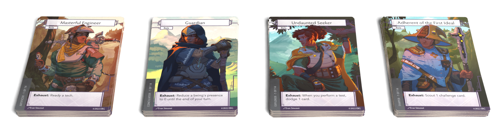

This page will appear as your mod description after you publish it. **Do not change the name from "About this Mod"**, or the mod manager will be unable to find it!

You can write this file in Obsidian alongside the rest of your mod content. The mod manager uses the same styles the base content uses, so use the same markdown syntax you'd use anywhere else in your campaign book. (Note that any changes you make to `ebr-styles.css` or `ebr-symbols.css` will *not* be reflected in your mod's description in the app.)

This template is just a suggestion. Feel free to adapt it however you want. Be creative!

## Features

- It's a good idea to include a list of stuff that makes your mod interesting.
- New missions, NPCs, locations, mechanics, balance tweaks; whatever you've got.
- Keep it scannable!
- Warn people if your description contains spoilers.

## Images

You can drop images anywhere in Obsidian and reference them with relative paths. Unless you have a good reason to put them elsewhere, you might as well put them in the Pictures folder.

## Credits

- **Developers:** Your name and the names of any co-conspirators.
- **Builds on:** List anybody else's work you used to help produce this mod, with a thank-you to their authors. We all stand on the shoulders of giants!
- **Playtesters:** The folks who helped you sand off all those rough edges.